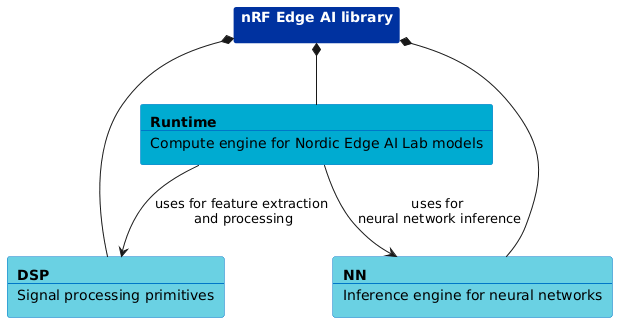

.. _nrf_edgeai_lib:

nRF Edge AI Library
###################

.. contents::
   :local:
   :depth: 2

The nRF Edge AI library is an optimized compute library for deploying Edge AI applications on Nordic Semiconductor devices.

Overview
********

The library consists of several core modules:

* Runtime - Compute engine for running `Nordic Edge AI Lab`_ generated models.
* Digital Signal Processing (DSP) - Signal processing primitives for feature extraction (FFT, spectral analysis, statistics, and others).
* Neural Network (NN) - Inference engine for neural network models.

See the following image to understand the structure and dependencies of the nRF Edge AI library:

The library provides the following key features:

* It is written in portable C with no external dependencies beyond libc.
* Memory footprint is fixed and predictable, making it ideal for embedded systems.
* It is optimized for constrained microcontroller environments.
* It is provided as precompiled static libraries for common Cortex-M architectures.

Core modules
============

See the available modules for nRF Edge AI Library:

.. toctree::
   :maxdepth: 1

   nrf_edgeai/runtime
   nrf_edgeai/dsp
   nrf_edgeai/nn

Building and configuring
************************

You can enable the library in your application through Kconfig options in the |NCS| build system.
For details, see :ref:`ug_nrf_edgeai_integration`.

Once you enable the ``CONFIG_NRF_EDGEAI`` Kconfig option, the build system automatically builds and links the library with your application:

1. It locates the precompiled static library for your target architecture (for example, ``libnrf_edgeai_cortex-m4.a``).
#. It includes the header files from the :file:`include/nrf_edgeai/` directory.
#. It compiles and links your `Nordic Edge AI Lab`_-generated model sources with the your application. (for example, :file:`nrf_edgeai_user_model.c`)
#. It compiles and links your firmware application with the library.

API documentation
*****************

| Header files: :file:`include/nrf_edgeai`
