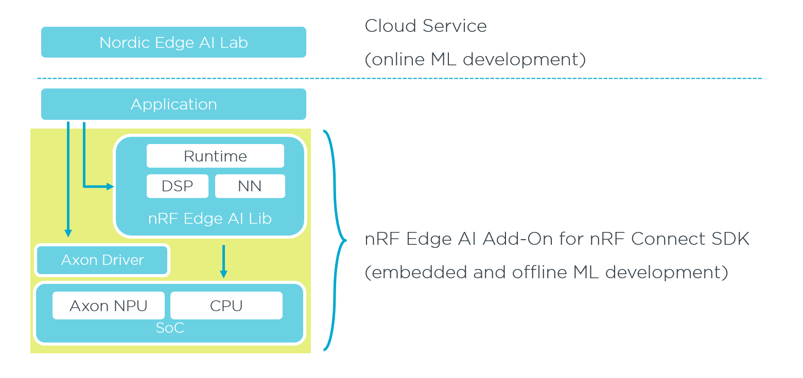

.. _solution_comparison:

Solution overview
#################

.. contents::
   :local:
   :depth: 2

The |EAI| offers several solutions for running machine learning models on Nordic Semiconductor devices.
Each solution combines a model training toolchain, a runtime or driver layer, and a hardware execution target (CPU or Axon NPU) into an end-to-end workflow.
The following diagram illustrates how these layers relate to each other:

   High-level architecture of the |EAI|.

The `Nordic Edge AI Lab`_ cloud service handles online model development, while the on-device stack, consisting of the |EAILib|, the Axon driver, and the SoC hardware, handles embedded inference.

Solutions are grouped into :ref:`basic <solution_comparison_basic>` and :ref:`advanced <solution_comparison_advanced>` categories.
Basic solutions provide higher-level APIs and integrated toolchains that minimize setup effort, while advanced solutions expose lower-level interfaces for fine-grained control over inference execution and resource usage.

If you are unsure which solution fits your use case, refer to the table below for a quick comparison:

.. list-table:: Solution comparison
   :header-rows: 1
   :widths: 20 20 15 15 30

   * - Solution
     - Training toolchain
     - Execution target
     - Level of control
     - Best for
   * - :ref:`nRF Edge AI Lib API with Axon <solution_edgeai_axon>`
     - `Nordic Edge AI Lab`_
     - Axon NPU
     - High-level API
     - NPU-accelerated full machine learning pipeline with minimal integration effort
   * - :ref:`nRF Edge AI Lib API with Neuton <solution_edgeai_neuton>`
     - `Nordic Edge AI Lab`_
     - CPU
     - High-level API
     - Broad device compatibility with ultra-low memory footprint
   * - :ref:`Axon driver <solution_axon_driver>`
     - :ref:`Axon NPU TFLite compiler <axon_npu_tflite_compiler>`
     - Axon NPU
     - Low-level driver API
     - Custom inference pipelines, direct NPU control, and advanced optimization
   * - :ref:`Edge Impulse <solution_edge_impulse>`
     - `Edge Impulse studio`_
     - CPU or Axon NPU
     - High-level API
     - End-to-end machine learning workflow with visual tools and community ecosystem

.. _solution_comparison_basic:

Basic solutions
***************

Basic solutions rely on integrated toolchains and higher-level APIs that abstract most of the model deployment and runtime details.
Use them to get started quickly with minimal configuration.

.. _solution_edgeai_axon:

nRF Edge AI Lib API with Axon
=============================

This solution uses models trained with the `Nordic Edge AI Lab`_ and deploys them through the |EAILib| API onto devices equipped with the `Axon NPU`_.
The Nordic Edge AI Lab allows for model design, training, and optimization in the cloud.
On the device, the |EAILib| provides a complete machine learning (ML) pipeline that covers the full path from raw sensor data to actionable results: its DSP module performs feature extraction (windowing, spectral transforms, statistical features), and its NN module runs inference on the Axon NPU.
A lightweight runtime ties these stages together, so applications only interact with a single high-level API.

Use this solution when you want a full, NPU-accelerated ML pipeline with a standardized API and minimal integration effort.

Key characteristics:

* Models are trained and exported from the `Nordic Edge AI Lab`_ web tooling.
* The |EAILib| delivers the complete on-device pipeline: signal processing, feature extraction, and neural network inference.
* Inference runs on the Axon NPU for higher throughput and lower power consumption compared to executing on the CPU.
* The API abstracts the entire pipeline, keeping applications model-agnostic.
* Requires a device with `Axon NPU`_ hardware.

See :ref:`quick_start_nrf_edgeai` to get started.

.. _solution_edgeai_neuton:

nRF Edge AI Lib API with Neuton models
======================================

This solution uses Neuton models trained with the `Nordic Edge AI Lab`_ and deploys them through the |EAILib| API.
As with the Axon variant, the |EAILib| provides the complete on-device ML pipeline, including DSP-based feature extraction and neural network inference, but executes entirely on the CPU.
This makes the solution compatible with a wide range of Nordic Semiconductor devices, including those without an NPU.

The Neuton models are highly optimized and have a minimal memory footprint.
Typical resource requirements for Neuton models are 1--5 KB of RAM and 5--10 KB of Non-Volatile Memory (NVM).
Actual RAM and NVM usage depends on the model complexity and the selected signal-processing pipeline.

Use this solution when you need broad device compatibility, an ultra-small footprint, or when your target hardware does not include an NPU.

Key characteristics:

* Models are trained and exported from the `Nordic Edge AI Lab`_ web tooling.
* The |EAILib| delivers the complete on-device pipeline: signal processing, feature extraction, and neural network inference.
* Inference runs on the CPU using the Neuton compute engine inside the |EAILib|.
* Written in portable C with no external dependencies beyond libc.
* Supports classification, regression, and anomaly detection use cases.

See :ref:`quick_start_nrf_edgeai` to get started.

.. _solution_edge_impulse:

Edge Impulse
============

This solution uses the `Edge Impulse`_ platform to provide an end-to-end machine learning workflow, from data collection and model training through deployment on Nordic Semiconductor devices.
|EIS| offers a visual development interface for designing signal-processing and ML pipelines (called *Impulses*), and generates a portable C++ library that can be compiled together with your |NCS| application.
Depending on the target device, inference can run on the CPU or be accelerated by the `Axon NPU`_ for higher throughput and lower power consumption.

Use this solution when you prefer a guided, visual ML workflow, when you need built-in data collection tooling, or when you are already working within the Edge Impulse ecosystem.

Key characteristics:

* Models are trained and exported from `Edge Impulse studio`_.
* Inference runs on the CPU or on the Axon NPU, depending on the target device.
* Includes tools for sensor data collection, such as the :ref:`ei_data_forwarder_sample`, and supports data upload from mobile devices.
* Deployed as a Zephyr library package that integrates directly into the |NCS| build system.
* Extensive documentation and community-contributed datasets are available through the Edge Impulse platform.

See :ref:`quick_start_edge_impulse` for CPU-based deployment, or :ref:`quick_start_axon_edge_impulse` for NPU-accelerated deployment.

.. _solution_comparison_advanced:

Advanced solutions
******************

Use the following advanced solutions when you need lower-level control, custom inference pipelines, or direct access to hardware acceleration features.
These workflows require more manual configuration but offer finer control over performance and resource usage.

.. _solution_axon_driver:

Axon driver
===========

This solution gives you direct access to the Axon NPU through the Axon driver API.
You compile TensorFlow Lite models with the :ref:`Axon NPU TFLite compiler <axon_npu_tflite_compiler>` and implement custom inference pipelines using the driver's synchronous or asynchronous execution modes.

Use this solution when you need maximum control over inference scheduling, memory management, and NPU resource utilization, or when your application requires custom pre- and post-processing that goes beyond what higher-level APIs provide.

Key characteristics:

* Models are compiled from TensorFlow Lite format using the :ref:`Axon NPU TFLite compiler <axon_npu_tflite_compiler>`.
* The driver supports both synchronous (blocking) and asynchronous (callback-based) inference.
* Memory is managed through a shared interlayer buffer, sized to the largest model in the system.
* Provides a host-based software simulator for development and testing without hardware.
* Requires a device with `Axon NPU`_ hardware for on-target deployment.

See :ref:`quick_start_axon_driver` to get started.
